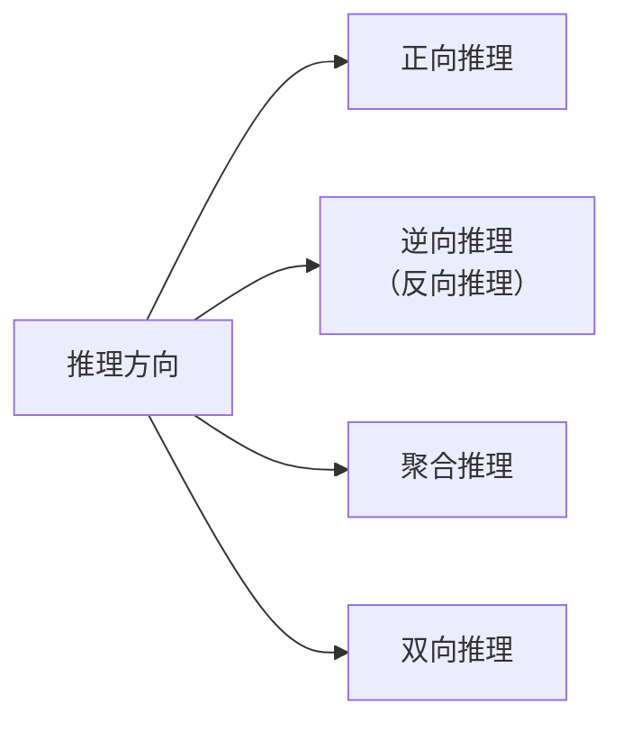
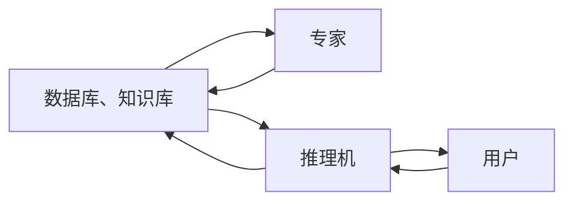

### 3.1.1 推理的定义

**推理**（reasoning）是指系统利用已有知识（如事实、规则、模型、经验等）对新的输入、问题或情境进行分析、判断和推导，从而得出合理结论或做出决策的过程。它是人工智能实现“智能行为”的核心机制之一，体现了系统对知识的理解、应用和生成能力。

### 3.1.2 推理方式及其分类

1. **演绎推理、归纳推理、默认推理**

##### (1) 演绎推理

一般->个别

- **三段论式**（三段论法）

##### (2) 归纳推理

- 完全归纳推理（必然性推理）
- 不完全归纳推理（非必然性推理）

##### (3)默认推理

- 知识不完全的情况下假设某些条件已经具备所进行的推理

2. **确定性推理、不确定性推理**

(1)**确定性推理**：推理时所用的知识与证据都是确定的，推出的结论也是确定的，其真值或者为真或者为假。

(2)**不确定性推理**：推理时所用的知识与证据不都是确定的，推出的结论也是不确定的。

3. **单调推理、非单调推理**

(1)**单调性推理**：如果系统每步推出的结论**一旦成立永远成立**，不会因后续加入新知识而被撤销或修改，则称这种推理是**单调的**。

(2)**非单调性推理**：当新知识加入后，**原有结论可能被否定、撤销或修正**，则称这种推理是**非单调的**。

4. **启发性推理、非启发性推理**

- **启发性推理**（Non-monotonic Reasoning）是指系统在**信息不完整或动态变化**的情况下，通过**默认假设**、**优先级**或**例外机制**得出结论，并允许**新知识推翻旧结论**的推理方式。其核心特征是**可撤销**（defeasible）——即结论**不保证永久有效**，当遇到更强的反面证据时，系统会**收回或修正**先前结论。

### 3.1.3 推理的方向

4. **双向推理**

	正向推理与逆向推理同时进行，且在推理过程中的某一步骤上“**碰头**”的一种推理

### 3.1.4 冲突消解策略

- 已知事实与知识的三种匹配情况

1. 恰好匹配成功（一对一）
2. 不能匹配成功
3. 多种匹配成功（一对多、多对一、多对多）

- 多种冲突消解策略

1. 按针对性排序
2. 按已知事实的新鲜性排序
3. 按匹配度排序
4. 按条件个数排序